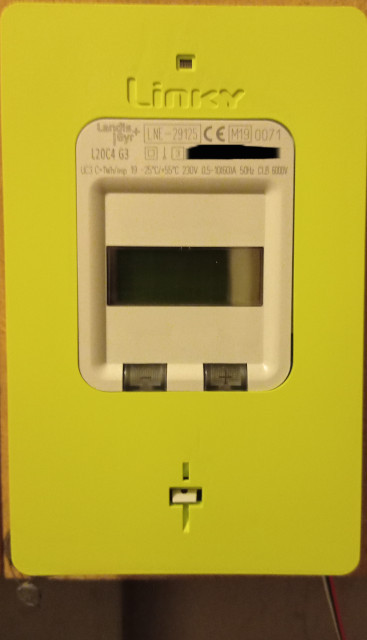
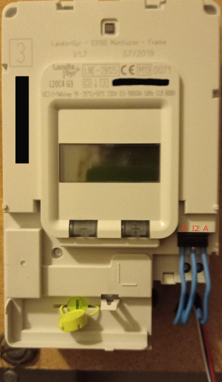
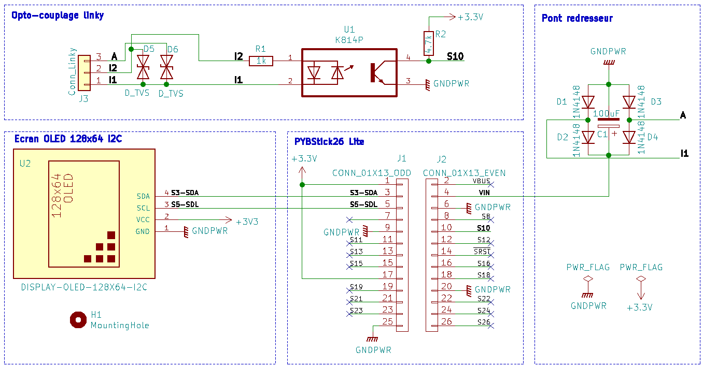
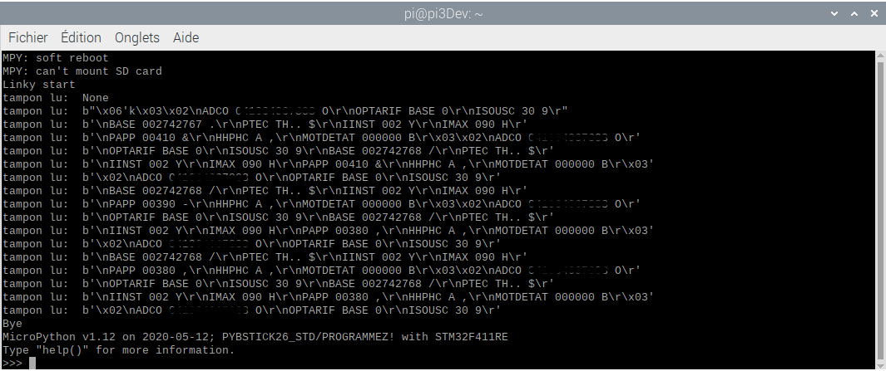

# Linky

Affichage déporté et auto-alimenté compteur linky - DIY

Ce projet permet de déporter l'affichage d'un compteur linky sur un petit écran OLED piloté par un mico-controleur PybStick26 lite si peu gourmand en energie qu'il peut être auto-alimenté directement par la prise TIC du compteur Linky sans aucune source 220v. Cela permet de voir en temps réèl la consommation en W, les indexes WH, les informations de contrat etc ... sans avoir à descendre dans son garage ou dans le local dans lequel le compteur est installé.

## Prise TIC du compteur

Il faut enlever le cadre vert clipsable (vous avez parfaitement le droit): la prise TIC se situe en bas à droite. Il s'agit d'un bornier sans vis composé de 3 sorties: I1, I2 et A. On peut y loger des fils rigides de section 1 à 1,5mm dedans.




Les informations du compteurs sont transmises via les prises I1 et I2 sous la forme d'un protocole UART 1200 bauds  sur une porteuse 50khz. Une trame est composée d'informations de 10 bits dont 1 bit start, 7 bits qui codent un caractère ASCII, 1 bit de parité et 1 bit stop. Le décodage UART va consister à récupérer les 7 bits composant un caractère ASCII et de stocker le tout dans un tampon que l'on va décoder.

Entre les prises I1 et A on peut récupérer une alimentation sous forme de courant alternatif 50khz qui oscille entre -16 et +16v (avec des pics à 20V, selon la longeur du câble que vous allez utiliser). Pour alimenter un micro-contrôleur qui exige du courant continu il faudra redresser, filrer et réguler cette alimentation, mais elle est **limité à 130mw**: il sera impossible par exemple d'espérer faire démarrer un Raspberry pi  (même un piZero) avec si peu de puissance.

Plus d'information techniques sur la [prise TIC](https://www.enedis.fr/sites/default/files/Enedis-NOI-CPT_54E.pdf)


Concenrant le câble, soit vous utilisez un câble monobrin (fils durs) de section 1mm et colorés, comme par exemple des câbles bon marchés téléphoniques ou d'alarme, soit vous utilisez une nappe souple mais il faudra souder les extremités sur des câbles durs (ce que j'ai fait): j'ai utilisé 5m de nappe souple bon marché utilisée pour alimenter des rubans de leds par exemple et ça fonctionne très bien.

## Circuit électronique


L'électronique se compose de 4 blocs principaux.
* **Opto-couplage du signal I1, I2**: un optocoupleur vishay K814P va permettre de récupérer le signal I1, I2 avec un jeux de résistances pour ne pas saturer le transistor. Nous ajoutons des diodes transil bidirectionnelles (16v DO-15) entre I1,I2 puis entre I1,A afin d'y limiter la tension à 16V. On peut faire sans mais elle sont là pour protéger des surtensions (j'ai déjà cramé une PYBStick à cause des pics de tensions qui grimpaient à 20v parfois sur la TIC de mon compteurlinky). Il vaut mieux les mettre...
* **PYBStick26**: un modèle Lite est suffisant. On récupère le signal pull-up de l'opto-coupleur sur la PIN S10 qui gère l'entrée Rx UART
* **Pont-redresseur**: 4 diodes 1N4148 vont redresser le signal entre I1 et A, puis une capactié 100uF va filtrer et lisser le signal. Avec en plus la diode Transil entre I1 et A on obtient ainsi un signal propre lissé à 16v max. La PYBStick étant équipée de son propre régulateur de tension, elle accepte en entrée Vin jusqu'à 18v: ce pont redresseur filtré est parfait pour l'alimenter.
* **Connecteur écran OLED**: un écran OLED I2C 0.96" ou 1.3" avec 4 broches est relié en I2C à la PYBStick26: ces écrans consomment très peu de puissance, bien moins qu'un écran LCD: ils sont parfait pour notre utilisation à puissance limitée à 130mw.

Le micro-contrôleur **PYBStick26** est bien adapté pour ce projet. Tout d'abord cocorico je rapelle qu'il s'agit d'un micro-contrôleur **made in France** que l'on peut trouver pour quelques € [ici](https://shop.mchobby.be/fr/micropython/1830-pybstick-lite-26-micropython-et-arduino-3232100018303-garatronic.html). Un modèle Lite est suffisant pour ce projet. Ce micro-controleur programmable en micro-python est équipé de connecteurs UART et I2C qui vont permettre de décoder le signal UART du compteur Linky et de communiquer avec un écran OLED I2C. Il intégre aussi son propre régulateur interne et accepte d'être alimentée aussi bien en 5v qu'en 18v max, donc pas besoin de rajouter un étage de régulation. Enfin cerise sur le gâteau il consomme à peine 20mA sous 5V on reste en dessous des 130mw max.

Petite présentation de la PYBStick26: c'est [par ici](https://www.papsdroid.fr/post/pybstick).

### Bilan du matériel nécessaire:
* 1 PYBStick26 Lite
* 2 pin header mâles 13 pins 2,54mm à souder sur la PYBStick26
* 1 bornier à vis, 3 pin 2,54mm pour racorder les 3 fils de la prise TIC (I1, I2, A)
* 2 diodes transil 16v DO-15
* 1 opto-coupleur Vishay K814P
* 1 résistance 1k
* 1 résistance 4,7k
* 4 diodes 1N4148
* 1 condensateur électrolyte polarisé 100uF 25V
* 1 condensateur céramique (non polarisé) 100nF
* 1 écran OLED I2C 0.96" ou 1.3" 128*64 pixels, équipé de 4 pin mâles 2.54mm

Le circuit est facilement réalisable sur une platine d'essai sans soudure de type breadboard.

Pour faire des tests et écrire le programme, j'ai relié ma PYBtick26 sur le port USB d'un Raspberry pi3b+ que j'ai laissé dans ma cuisine. Je me suis ensuite connecté en SSH depuis mon bureau sur ce Rapsberry pi pour pouvoir écrire et tester les programmes micro-python de la PYBStick. Ceci ma évité d'avoir à tirer un immense câble depuis mon compteur linky (proche de ma cuisine en fait) jusqu'à mon bureau: très pratique... Bien entendu pur l'utilisation finale on n'a plus besoin du Raspberry pi.

## programme de test pour récupérer la trame communiquée par prise TIC

Votre PYBStick26 doit être reliée à un ordinateur via sa prise USB pour voir sur un écran la trame communiquée par la prise TIC.
Dans ce cas il n'est pas nécessaire d'avoir le pont-redesseur, ni l'écran OLED, ni les diodes Transil pour cet essai,  puisque la PYBStick26 sera alimentée par la prise USB de L'ordi. (moi j'utilise un petit raspberry pi 3b+ auquel j'accède en SSH tranquillement depuis mon bureau).

ce programme est disponible dans les sources /tests
```python
 main.py -- put your code here!

import pyb
from time import sleep

print('Linky start')

# pybstick lite à 48MHz, config UART
pyb.freq(48000000)
buffer_size = 128
info = pyb.UART(2, 1200, bits=7, parity=0, stop=1, timeout=0)

def lecture_linky():
    while True:
        tampon=info.read(buffer_size)
        print('tampon lu: ', tampon)
        sleep(0.5)

try:
    lecture_linky()
except KeyboardInterrupt:
    print('Bye')
```

En vous connectant sur l'interpeteur REPL (screen /dev/ttyACM0 sous un système linux) depuis votre PC auquel la PYBSTICK26 est reliée , vous devez voir apparaître les caractères ASCII de la trame TIC lue dans le tampon:


Si vous ne récoltez que du "None" dans le tampon c'est que l'opto-couplage ne fonctionne pas: vérifiez bien les branchements. Si vous utilisez un autre opto-coupleur que le VIshay K814P il se peut qu'il soit plus ou moins vite saturé, dans ce cas il faut y aller à tâton avec les resistances: essayez par exemple 1.2k au lieu de 1k et 3,3k ou 2,2k au lieu des 4,7k pour le pull-up en sortie du transisor. Vous pouvez inverser I1 et I2 dans le montage ça n'a aucune importance.

## programme pour affichage sur écran OLED

Pour utiliser le dispositif complet auto-alimenté par la prise TIC, il faut d'abord réaliser le montage électronique complet, et ne surtout pas oublier les diodes transil qui vont protéger des surtensions (il y a des pics tueurs  à 20v !). Bien entendu ne reliez rien d'autre que la prise TIC I1, I2, et A sur votre circuit: **n'allez surtout pas y mettre du 220V** les diodes claqueraient fort mais vous vous métriez surtout en danger mortel d'électrocution!

Pour communiquer avec l'écran OLED il faut installer toutes les dépendances : déposez bien tous les fichiers fournis dans /microPython à la racine de votre PYBStick. 

Le script va lire en boucle la trame TIC stockée dans un tampon. il faut lire la doc de la prise TIC pour comprendre comment décoder cette trame mais ce n'est pas sorcier. Chaque indexe est fourni après un saut de ligne ('\n'), ensuite on a la valeur de l'indexe après un espace, et ainsi de suite. Chaque indexe a une taille qui lui est propre. Il suffit de stocker dans un dictionnaire les idexes que l'on veut rechercehr dans le tampon, avec leur taille on sait où récupérer les valeurs une fois que l'index est repéré dans le tampon, et le tour est joué.

Les deux boutons de la PYBStick26 sont programmés pour 
* allumer/etteindre l'écran si vous ne voulez pas qu'il reste allumé 7J/7 24h/24.
* faire défiler deux écrans: l'un qui affiche les données de puissance en temps réel, et un autre qui affiche les données contractuelles.

C'est une première version du programme, des améliorations sont en cours de réflexion et vous pouvez l'adapter à vos besoin.

## Usage ludique et instructif !

L'utlisation est très ludique est instructive. Allumez un lumière et vous verrez l'impact immédiat en W: une led va consommer 10W tandis qu'une ampoule à filament va brûler 50 à 80W!. Allumer votre télé, un ordinateur et plusieurs centaines de W se rajoutent. Le four électrique, bouilloire, micro-onde et le compteur s'affole avec plusieurs milliers de W, et retombe aussitôt les appareils étteints. Je trouve ça super rigolo est instructeur,c'est un très bon moyen de mieux consommer si on se rend compte en temps réel de sa consommation.
