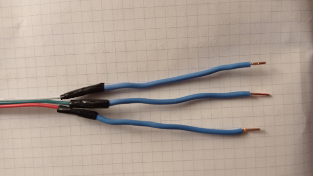

# Linky

Affichage déporté et auto-alimenté compteur linky - DIY

Ce projet permet de déporter l'affichage d'un compteur linky sur un petit écran OLED piloté par un mico-controleur PybStick26 lite si peu gourmand en energie qu'il peut être auto-alimenté directement par la prise TIC du compteur Linky sans aucune source 220v. Cela permet de voir en temps réèl la consommation en W, les indexes WH, les informations de contrat etc ... sans avoir à descendre dans son garage ou dans le local dans lequel le compteur est installé.

## Prise TIC du compteur

Il faut enlever le cadre vert clipsable (vous avez parfaitement le droit): la prise TIC se situe en bas à droite. Il s'agit d'un bornier sans vis composé de 3 sorties: I1, I2 et A. On peut y loger des fils rigides de section 1 à 1,5mm dedans.

Les informations du compteurs sont transmises via les prises I1 et I2 sous la forme d'un protocole UART 1200 bauds  sur un porteuse à 50khz. Une trame est composée d'informations de 10 bits dont 1 bit start, 7 bits qui codent un caractère ASCII, 1 bit de parité et 1 bit stop. Le décodage UART va consister à récupérer les 7 bits composant un caractère ASCI et de stocker le tout dans un tampon que l'on va décoder.

Entre les prises I1 et A on peut récupérer une alimentation sous forme de courant alternatif 50khz qui oscille entre -16 et +16v (avec des pics à 20V, selon la longeur du câble que vous allez utiliser). Pour alimenter un micro-contrôleur qui exige du courant continu il faudra redresser, filrer et réguler cette alimentation, mais elle est **limité à 130mw**: il sera impossible par exemple d'espérer faire démarrer un Raspberry pi  (même un piZero) avec si peu de puissance.

Plus d'information techniques sur la [prise TIC](https://www.enedis.fr/sites/default/files/Enedis-NOI-CPT_54E.pdf)

Concenrant le câble, soit vous utilisez un câble mono-brun (fils durs) de section 1mm et colorés, comme par exemple des câbles bon marchés téléphoniques ou d'alarme, soit vous utilisez une nappe souple mais il faudra souder les extremitées sur des bouts de câble dur (ce que j'ai fait): j'ai utilisé 5m de napple souple bon marché utilisée pour alimenter des rubans de leds par exemple et ça fonctionne très bien.

